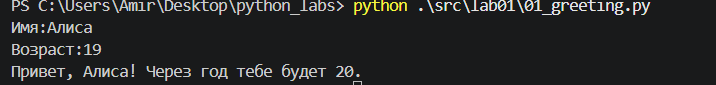
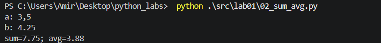
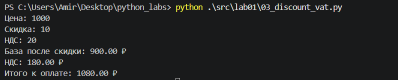
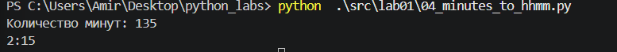
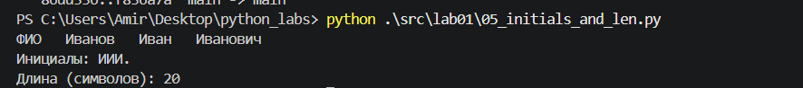
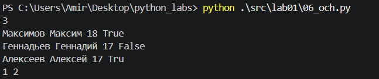
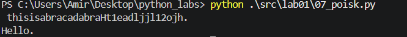

# Python Labs

## ЛР1 — Ввод/вывод и форматирование

### Задание 1

### Задание2

### Задание 3

### Задание 4

### Задание 5

С помощью s.strip() избавляемся от пробелов по бокам.
С помощью s.split() остается по одному пробелу между.
Собираем инициалы и создаем строку с полными словами и одним пробелом между.

### Задание 6

Проверяем по True/False на формат обучения

### Задание 7

Ищем индекс первой заглавной буквы и индекс следующей цифры. Расстояние между ними - шаг. И узнав шаг, собираем сообщение.

