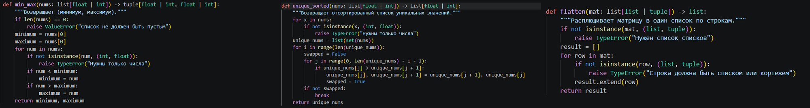
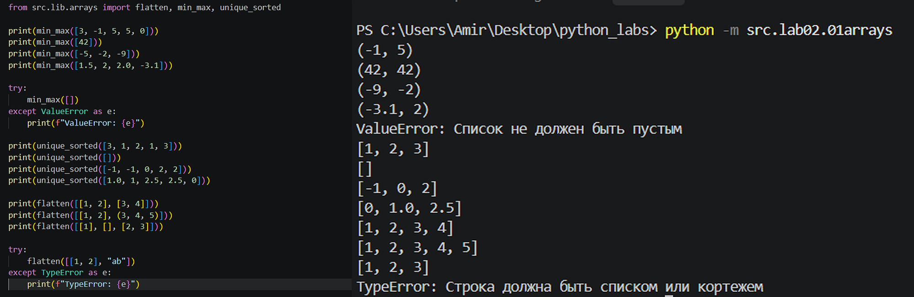
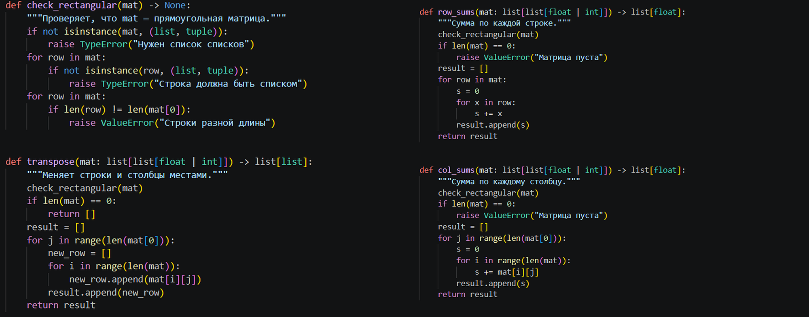
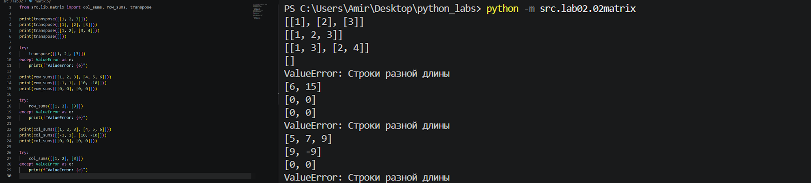
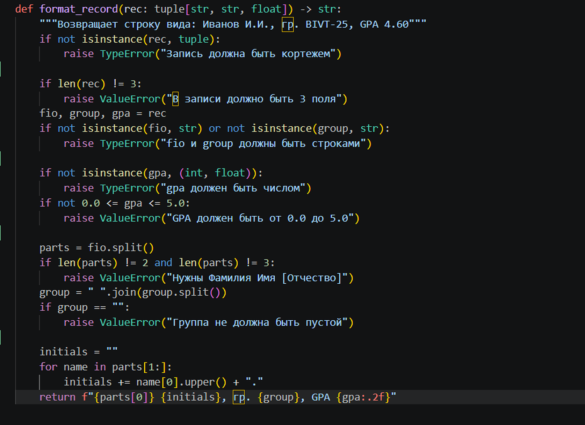
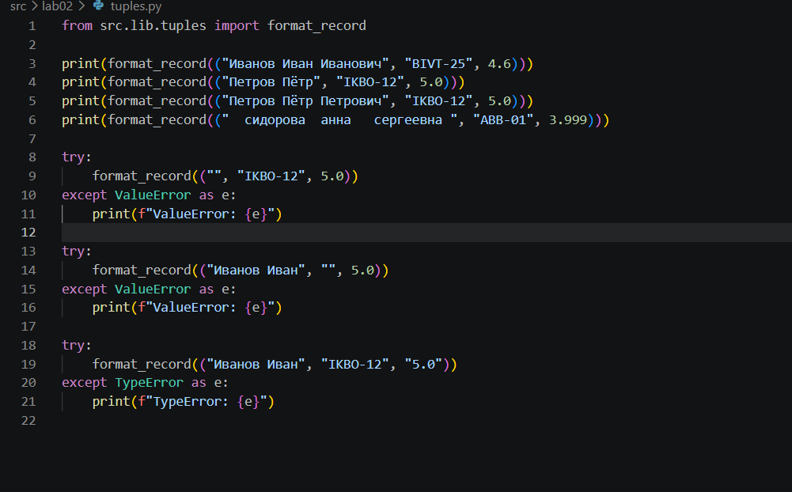
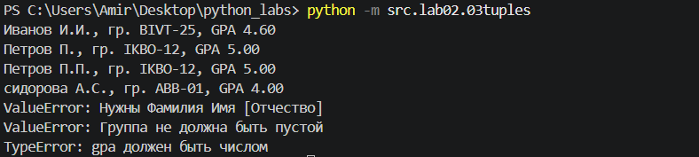

# ЛР2 

## Задание 1  (arrays.py)
Реализует функции для работы со списками: поиск минимума и максимума (`min_max`), получение отсортированного списка уникальных значений (`unique_sorted`) и "расплющивание" двумерной структуры в одномерный список (`flatten`). Функции в `src/lib/arrays.py`.

## Задание 2  (matrix.py)
Реализует операции над прямоугольными матрицами: транспонирование (`transpose`), расчет сумм элементов по строкам (`row_sums`) и по столбцам (`col_sums`). Содержит проверки на «рваные»(строки разной длины) матрицы с выбросом `ValueError`. Функции в `src/lib/matrix.py`.

  

## Задание 3  (tuples.py)
Обрабатывает кортежи с данными студентов вида `(fio, group, gpa)` и форматирует их в итоговую строку. Включает очистку лишних пробелов, генерацию инициалов, валидацию типов и округление GPA до двух знаков. Функции в `src/lib/tuples.py`.

